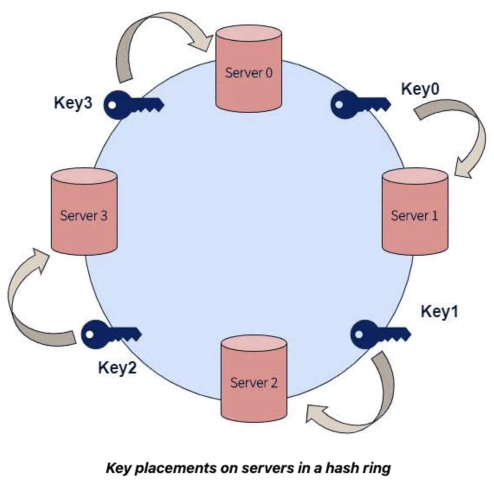

# Hash Tables

- caching;
- joins;
- distributed databases;
- partitioning;
- sharding;
- sets.

## Array

Consecutive slots in memory. Given the index you can go to any element in constant time O(1). Byte addressability.

## Hash Tables

Hash tables are glorified arrays. 

E.g. we have ID of student - we want to get student by this ID in O(1) time.

We can take ID and create hash of it. And this hash will be the same. From this hash we can calculate index (see *bloom caches*).

### Hash joining on Foreign key

Hash tables are used here too. 

In order to join the two tables you're going to pick one of relations and you're going to create hash table.

You are loop through every value of first table, hash it and put together with pointer to it's row. Then you go through second table and try to find each value in this hash table.

Building of this array is O(n) because you go through all values.

## Limitations

Hash tables can only be used when you can put it in memory.

Hash collisions.

Adding new slots to hash array is impossible, it needs the remapping of whole thing (because you are taking e.g. %10 from hash to get index, if you do %11 everything will change index).

Partitioning and sharding affected by this - when you add new machine you need to remap.

## Consistent Hashing

Solves the effect of remapping.

Concept of clockwise ring of servers with angles and approximate hash values. 

E.g. 60 is not 0 or 90 but it will go to 90 because it is after 60.

If we add new server - we still need to move data but not too much - it will just take some data from ONE next server in chain and thats all.

